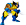

# HipChat emoticons

We've expanded on the core set of [emoticons included with HipChat](http://hipchat-emoticons.nyh.name) and added our own.

## Emoticons

 (avocado)
 (awesomesauce)
 (bacon)  
 (benforce)
 (bike)  
 (dietcoke)  
 (domo)  
 (gross)
 (hooray)
 (halfturkey)  
 (penguin)  
 (pizza)  
 (prosper)
 (redbull)  
 (sf)  
 (sushi)  
 (taco)  
 (tesla)  
 (wolverine)  
 (wonka)  

## People

You can also summon many of us using `(firstname)`.

 (adam)  
 (amy)  
 (anthony)
 (april)
 (barry)
 (ben)
 (brandon)
 (brett)  
 (chad)  
 (emma)
 (gracie)
 (hadrien)
 (jeff) or (nofun)
 (jennifer)  
 (jt)
 (kim)
 (rude)  
 (nick)  
 (sarah)  
 (sean)
 (tim) or (cool)  

## Creating your own emoticons

We are using HipChat's built-in emoticon feature, which means an admin must upload the image in order for it to work. However, you can still create a pull request to get your icon into the repo, then let a HipChat admin know.

* Max dimensions are 30px wide by 30px tall
* Use a transparent PNG or animated GIF for best results
* Images must be under 100Kb

